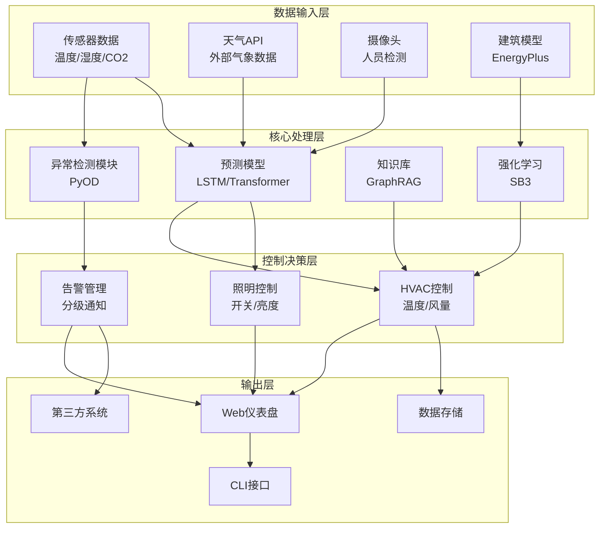
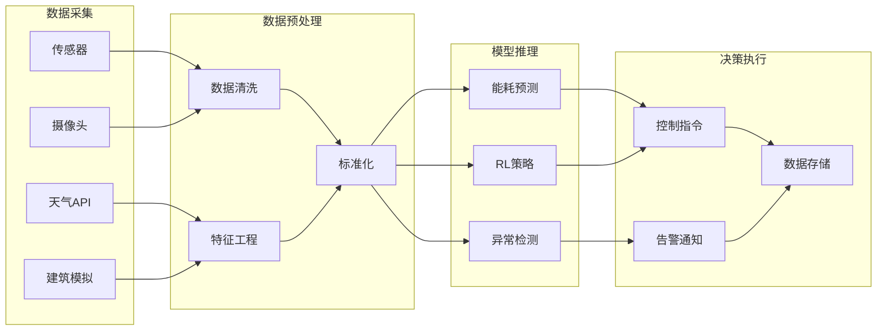
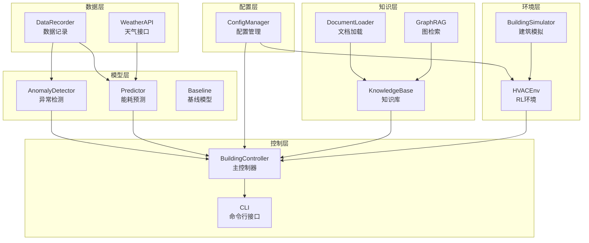
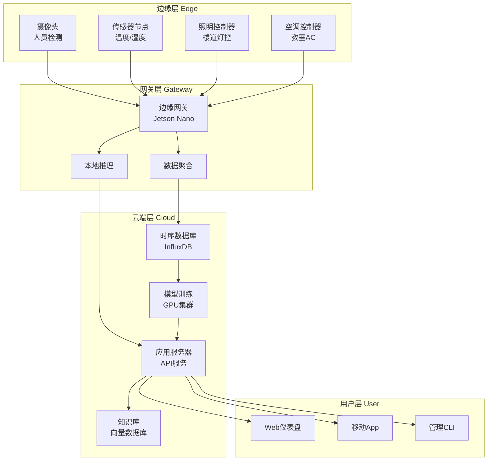
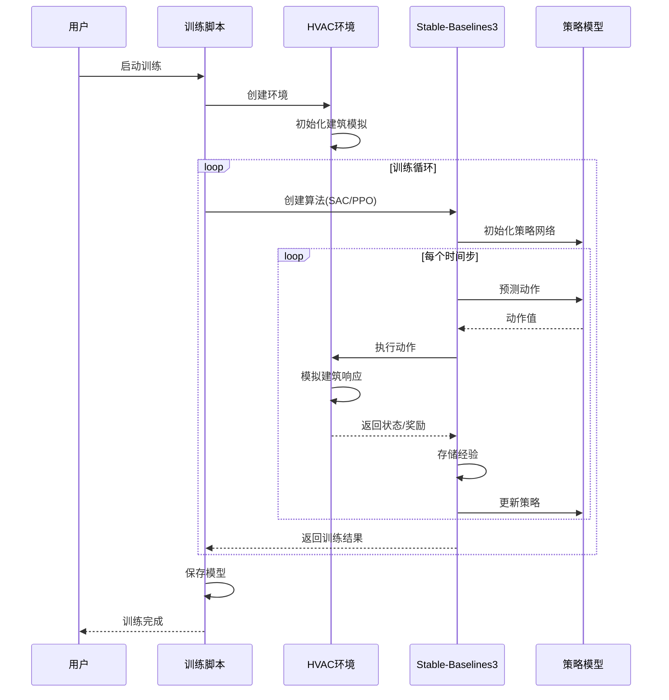
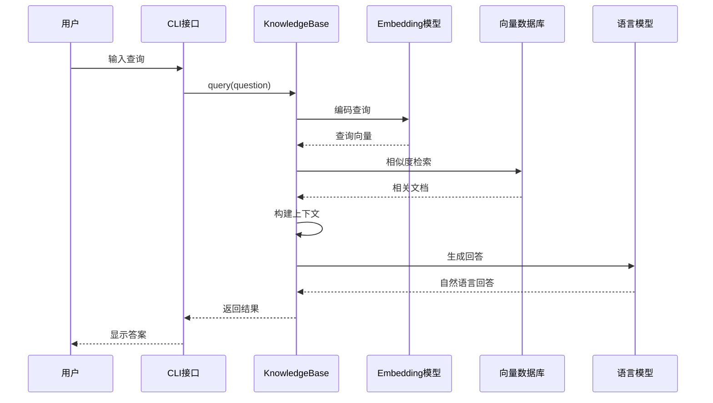
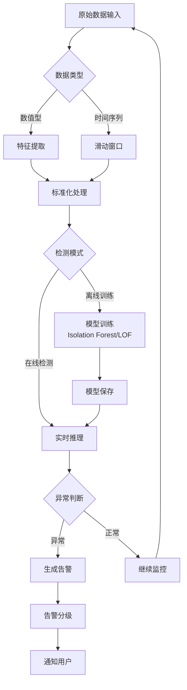
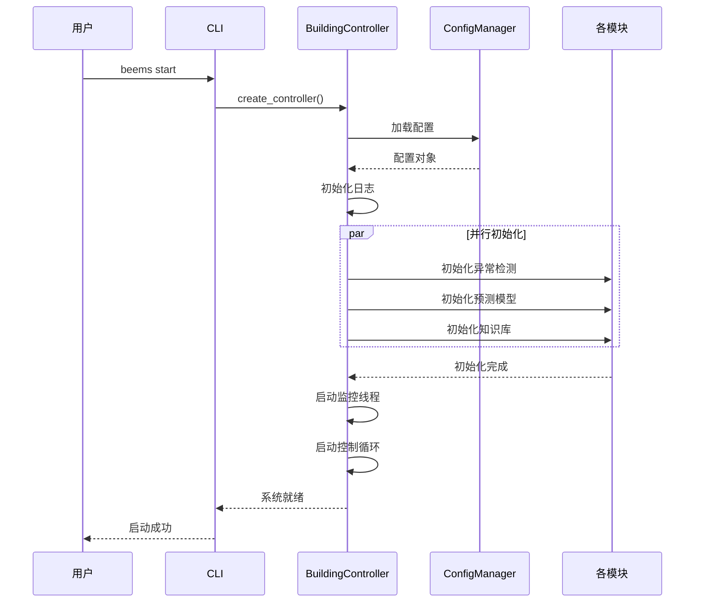
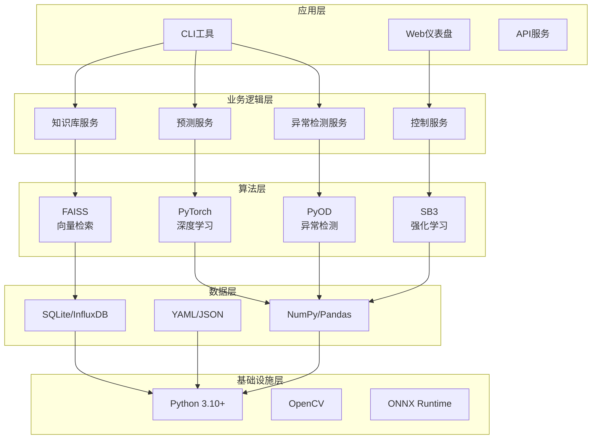
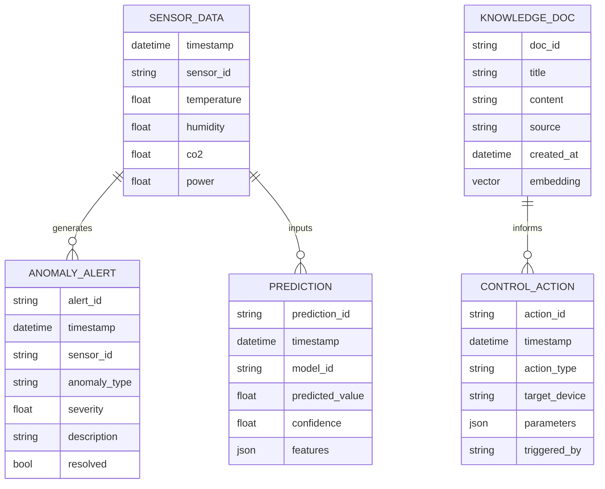

# 建筑智能节能系统 - 架构图

本文档使用 Mermaid 语法绘制系统的各种架构图。

---

## 1. 系统整体架构图

---

## 2. 数据流图

---

## 3. 模块依赖图

---

## 4. 部署架构图

---

## 5. 强化学习训练流程图

---

## 6. 知识库查询流程图

---

## 7. 异常检测流程图

---

## 8. 系统启动时序图

---

## 9. 技术栈架构图

---

## 10. 数据模型关系图

---

## 图例说明

| 符号 | 含义 |
|------|------|
| ⭕ 圆形 | 开始/结束节点 |
| ▭ 矩形 | 处理步骤 |
| ◇ 菱形 | 判断/决策 |
| → 箭头 | 数据/控制流向 |
| -- 虚线 | 异步/可选流程 |

---

## 相关文档

- [方向一技术栈研究](../direction1_tech_stack_research.md)
- [方向二技术栈研究](../direction2_tech_stack_research.md)
- [方向三技术栈研究](../direction3_tech_stack_research.md)
- [项目需求文档](../project_requirements.md)
